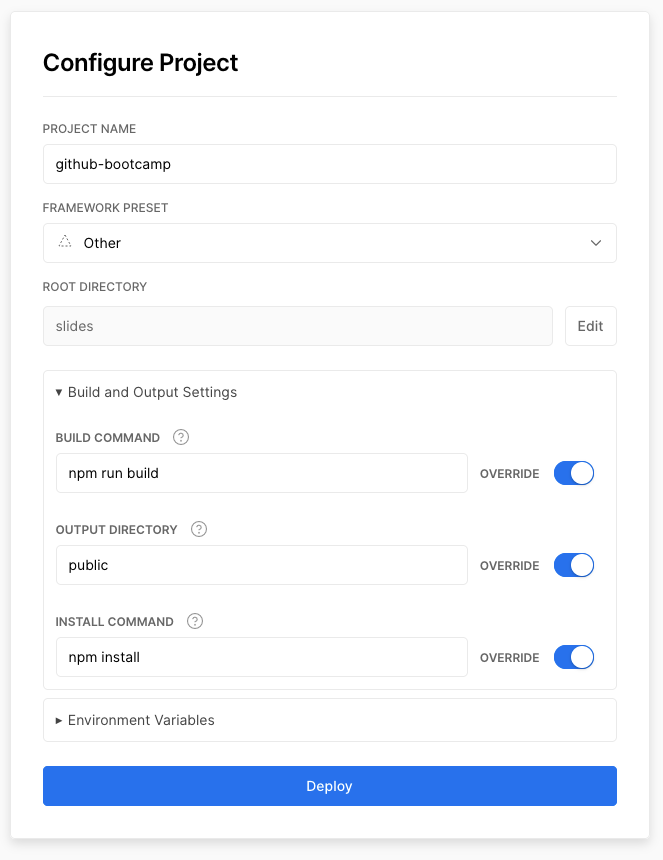
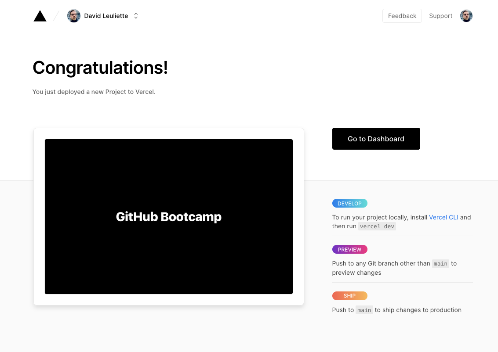

# Lesson

## What you will learn

- Working with GitHub
- Working with GitHub

## 👾 Before we start the exercise

- check [`gh` cli documentation](https://github.com/cli/cli)
- https://www.makeareadme.com/

## 👨‍🚀 Exercise 3.1


- [ ] Create a new repo on [repo.new](https://repo.new)

```console
git remote add origin https://github.com/USERNAME/REPO.git
git branch -M main
git push -u origin main
```

But this is anoying because it will ask you your credentials everytime 😦

We can fix it using `ssh` instead of `https`

```console
git remote set-url origin git@github.com:USERNAME/REPO.git
```

- [ ] change the origin of the remote

- [ ] push you repo to github

## 👨‍🚀 Exercise 3.2

- [ ] Try to use only the cli `gh repo view --web` is nice
- [ ] Create a [new project on vercel](https://vercel.com/new) and release on production

Your configuration should look like this (except the `slides` folder)



If everything works fine you should have this screen



## 👨‍🚀 Exercise 3.3

- [ ] Write a nice README, you can [have a nice template on makeareadme](https://www.makeareadme.com/)
- [ ] Using only the cli create a new branch and open a pull request

## 👽 Bonus

- [ ] create a new issue on your repo
- [ ] make a commit with `gcmsg 'feat: automation FTW closes #1'`
Notice using "closes #1" in the commit message [will automatically close the issue on GitHub](https://docs.github.com/en/issues/tracking-your-work-with-issues/linking-a-pull-request-to-an-issue#linking-a-pull-request-to-an-issue-using-a-keyword)


## 🏅 Elaboration and Feedback

After the exercice, to __remember what you've just learned__, then [fill out the elaboration and feedback form](https://airtable.com/shrBuZqOJL5UeLLF1?prefill_Name=github%20101&prefill_Exercice=03).
