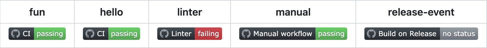

# GitHub actions events

## What you will learn

- Trigger GitHub action events

## 👾 Before we start the exercise

- Here is the list of [GitHub actions events](https://docs.github.com/en/actions/using-workflows/events-that-trigger-workflows)

## 👨‍🚀 Exercise 2.1

- [ ] Create a **Push Event**

```yml
name: CI on Push
on:
  push:
    branches:
      - main

jobs:
  build:
    runs-on: ubuntu-latest
    steps:
      - name: Checkout code
        uses: actions/checkout@v4
      - name: Run a one-line script
        run: echo Hello, Push Event!
```

- [ ] Commit to your repository to launch the action

## 👨‍🚀 Exercise 2.2

- [ ] Create a **Pull Request Event**

```yml
name: CI on Pull Request
on:
  pull_request:
    branches:
      - main

jobs:
  test:
    runs-on: ubuntu-latest
    steps:
      - name: Checkout code
        uses: actions/checkout@v4
      - name: Run a one-line script
        run: echo Hello, Pull Request Event!
```

- [ ] Commit to your repository to launch the action

## 👨‍🚀 Exercise 2.3

- [ ] Create a **Schedule Event**

```yml
name: Nightly build
on:
  schedule:
    - cron:  '0 0 * * *'

jobs:
  build:
    runs-on: ubuntu-latest
    steps:
      - name: Checkout code
        uses: actions/checkout@v4
      - name: Run a one-line script
        run: echo Hello, Scheduled Event!        
```

In this example, the workflow runs every day at midnight (UTC).

- [ ] Update the hour to launch the action

## 👨‍🚀 Exercise 2.4

- [ ] Create a **Release Event**

```yml
name: Build on Release
on:
  release:
    types: [created]

jobs:
  build:
    runs-on: ubuntu-latest
    steps:
      - name: Checkout code
        uses: actions/checkout@v4
      - name: Run a one-line script
        run: echo Hello, Release Event!                
```

In this example, the workflow runs whenever a new release is created in the repository.

- [ ] Create a GitHub release to launch the action

## 👨‍🚀 Exercise 2.5

- [ ] Create a **Manual Event**

This event allows you to trigger a workflow manually from the GitHub UI.

```yml
name: Manual workflow
on:
  workflow_dispatch:

jobs:
  build:
    runs-on: ubuntu-latest
    steps:
      - name: Checkout code
        uses: actions/checkout@v4
      - name: Run a one-line script
        run: echo Hello, Manual Event!           
```

- [ ] Manual dispatch the action

## 👽 Bonus

That's a lot of events! To quickly identify if everything is working as expected, you can create a **workflow status badge**.

- [ ] Update your `README.md` with the following snippet with your GitHub username, repository name, and workflow filename.

```markdown

```

Here is a preview of the badges:



## 🏅 Elaboration and Feedback

After the exercice, to **remember what you've just learned**, then [fill out the elaboration and feedback form](https://airtable.com/shrBuZqOJL5UeLLF1?prefill_Name=GitHub%20103&prefill_Exercice=02).
