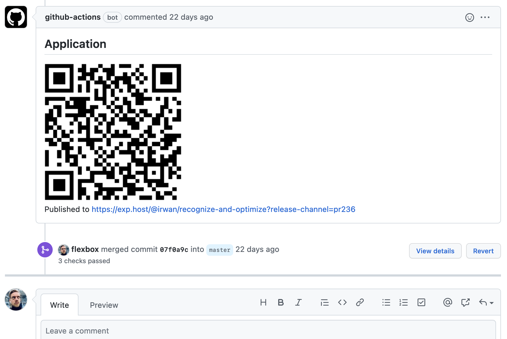

# Community GitHub Actions

## What you will learn

- Use the marketplace to find a GitHub action
- Handle secrets in GitHub actions

## 👾 Before we start the exercise

- Have a look the [GitHub marketplace](https://github.com/marketplace?type=actions)

## 👨‍🚀 Exercise 3

- [ ] create a new file `.github/workflows/linter.yml`

```yml
name: Linter

on: push

jobs:
  build:
    name: Lint
    runs-on: ubuntu-latest

    permissions:
      contents: read
      packages: read
      # To report GitHub Actions status checks
      statuses: write

    steps:
      - name: Checkout code
        uses: actions/checkout@v4
        with:
          # super-linter needs the full git history to get the
          # list of files that changed across commits
          fetch-depth: 0

      - name: Super-linter
        uses: super-linter/super-linter@v6.3.1  # x-release-please-version
        env:
          # To report GitHub Actions status checks
          GITHUB_TOKEN: ${{ secrets.GITHUB_TOKEN }}
```

- [ ] Commit to a new branch
- [ ] Open up a pull request and observe the action working

There is a lot you can automate with GitHub actions.

As a react native devloper, I use `actions/setup-node`, `expo/expo-github-action`, `mshick/add-pr-comment` to write a comment on each pull-request with a QR code to download the new version of my `iOS` and `Android` app on my phone for testing purposes.



The sky is the limit!

## 👽 Bonus

- [ ] Create an awesome [github profile with github actions](https://github.com/marketplace?category=&type=actions&verification=&query=profile+readme)

_Examples:_

- Update your [profile last youtube video](https://github.com/flexbox/flexbox)
- Get [picture from instagram](https://github.com/katydecorah/instagram-rss-action)
- Automatically update [what you're currently reading](https://github.com/marketplace/actions/goodreads-profile-workflow)
- Your top [spotify tracks](https://github.com/izayl/spotify-box)

## 🏅 Elaboration and Feedback

After the exercice, to **remember what you've just learned**, then [fill out the elaboration and feedback form](https://airtable.com/shrBuZqOJL5UeLLF1?prefill_Name=GitHub%20103&prefill_Exercice=03).
