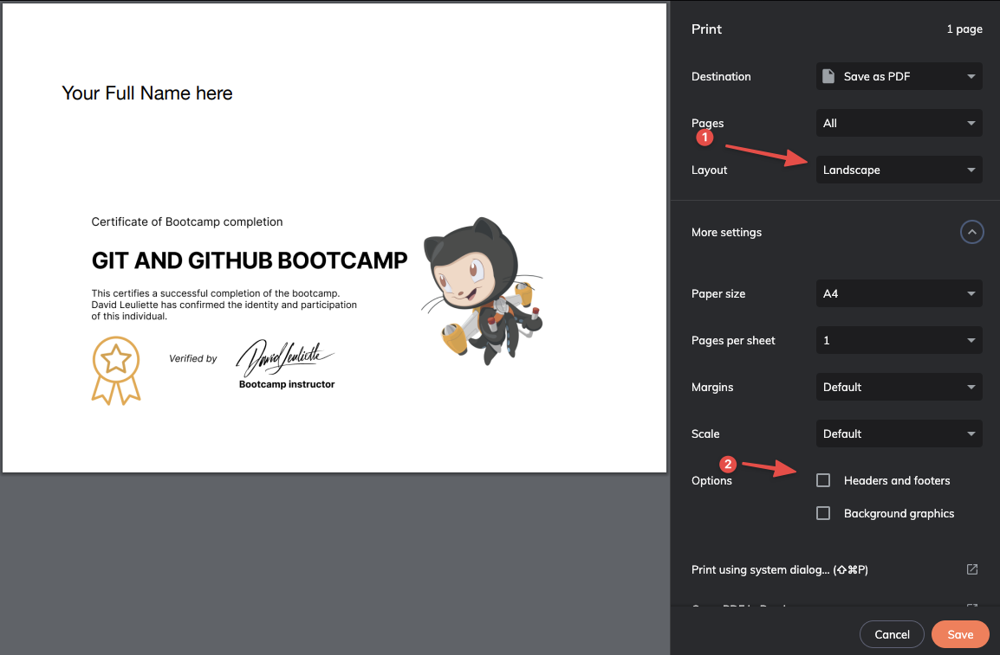
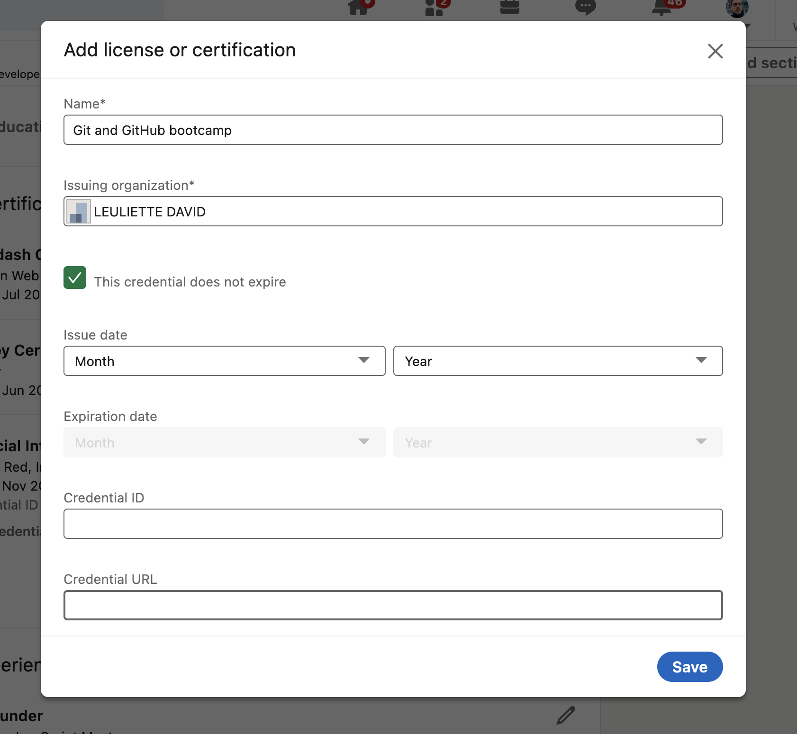

# Certification

## What you will learn

- Create your certificate

## 👨‍🚀 Exercise 4

- [ ] Add a new slide certificate with your name on it

```markdown
---

      Your Full Name here


---

```

- [ ] Open google chrome and print the page as a `.pdf` with `cmd` + `p`



- [ ] Commit all your files
- [ ] Go on LinkedIn Profile > Certification


- [ ] Add your certificate with these informations

```
Name:
Git and GitHub Bootcamp

Issuing organisation:
LEULIETTE DAVID

Credential URL:
The url of your .pdf on GitHub
```



👏 Congratulations!

I hope you enjoyed the bootcamp and please can you take 3 min [to fill this feedback from?](https://davidl.fr/feedback-workshop)
