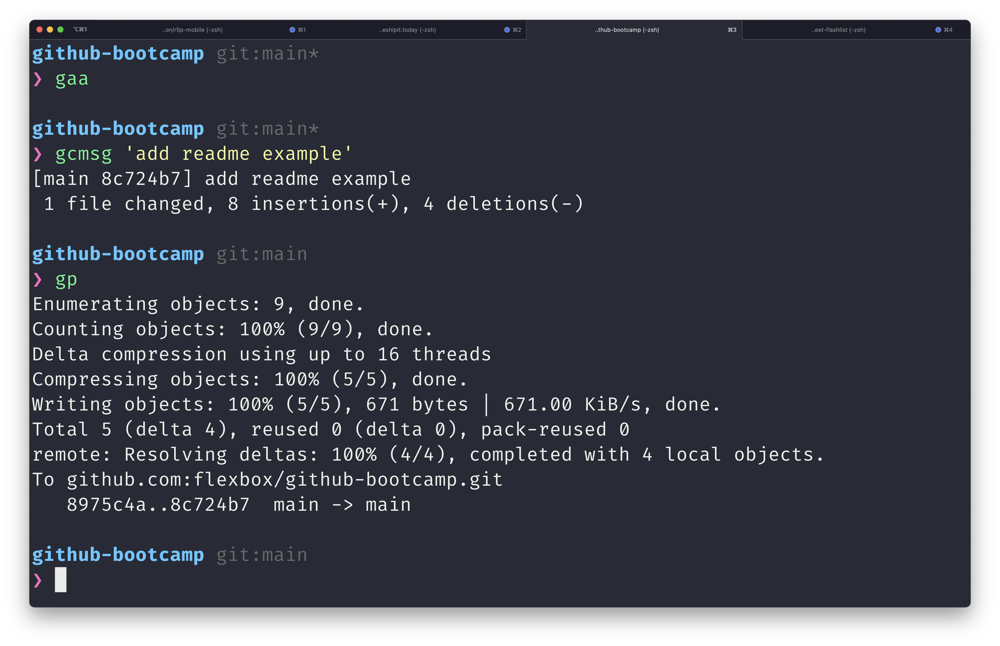
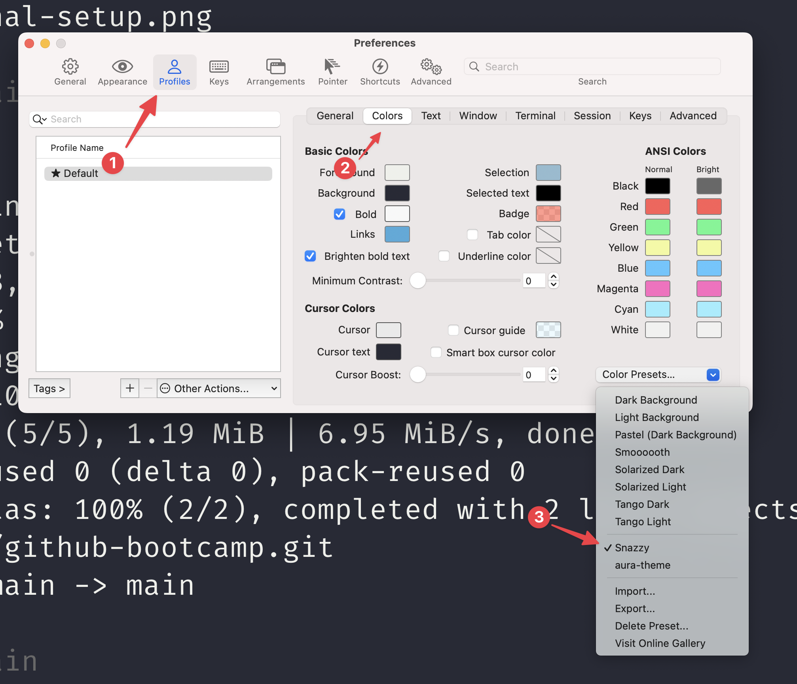

# Bootcamp Setup

## System Requirements

<details><summary>macOS</summary>
<p>

```console
brew install git
```

</p>
</details>

<details><summary>Linux</summary>
<p>

```console
apt-get install git
```

</p>
</details>

<details><summary>windows</summary>
<p>

[Download](http://git-scm.com/download/win)

</p>
</details>

Use the following command at your terminal to check your git version.

```console
git --version
```

If you have a recent version installed, it should do.

## Tools of Titans

To work faster and become a comand line power user we are going to use 3 tools: the software `iterm2`, the configuration terminal framework `oh-my-zsh` and the command line interface tool `gh`.



_Note: this is my setup with `refined` theme and `Snazzy` colors_

### iterm2

`iTerm2` is a replacement for `Terminal`. It works on Macs only. iTerm2 brings the terminal into the modern age with features you never knew you always wanted.

- [ ] install iterm2

```console
brew install --cask iterm2
```

- [ ] change the color scheme, open the settings and go to `Profiles` > `Colors` > `Color Presets`



you can select a color scheme from the list or [import a custom one](https://iterm2colorschemes.com/).

### `oh-my-zsh`

Oh My Zsh is a delightful, open source, community-driven framework for managing your Zsh configuration. It comes bundled with thousands of helpful functions, helpers, plugins, themes, and a few things that make you shout...


On macOS, you can install it with:

```console
sh -c "$(curl -fsSL https://raw.github.com/ohmyzsh/ohmyzsh/master/tools/install.sh)"
```

#### Changing theme

```console
omz theme list
omz theme set THEME_NAME
```

#### [Install plugins](https://github.com/ohmyzsh/ohmyzsh/wiki/Plugins)

ZSH allows you to extend built-in functionality by adding plugins.

```console
omz plugin list
omz plugin enable PLUGIN_NAME
omz plugin disable PLUGIN_NAME
```

https://github.com/ohmyzsh/ohmyzsh/wiki/Plugins

To enable a plugin, open your `.zshrc` file and add these:

```console
# Useful oh-my-zsh plugins
plugins=(git gitfast common-aliases zsh-syntax-highlighting history-substring-search zsh-autosuggestions zsh-z)
```

### `gh` - [cli.github.com](https://cli.github.com/)

`gh` is GitHub on the command line. It brings pull requests, issues, and other GitHub concepts to the terminal next to where you are already working with git and your code.

```console
brew install gh
```